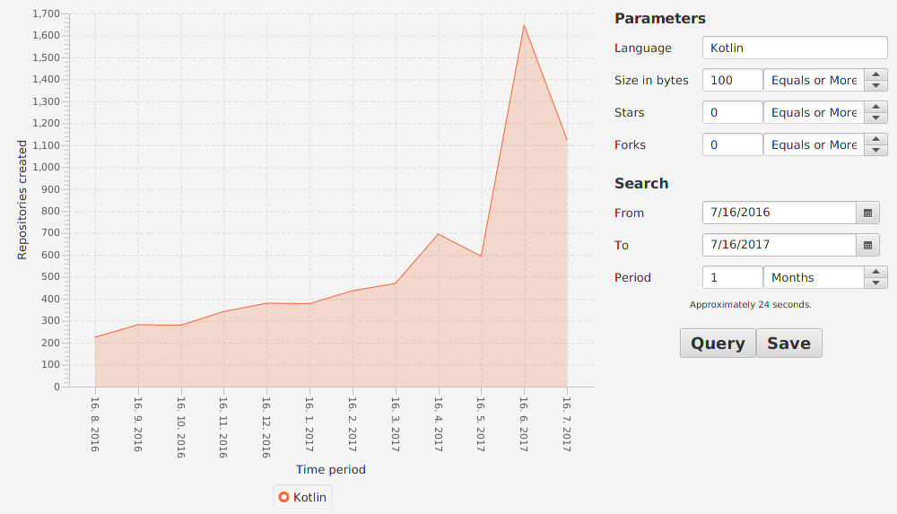

# Fake Social Project
Fake Social Project is part of my UNI thesis about comparing Android developement with Java versus Android developement with Kotlin.

### Modules
Project is separated into multiple modules.
- Java Fake Social ([HERE](https://github.com/SlickBot/JavaFakeSocial/))
- Kotlin Fake Social ([HERE](https://github.com/SlickBot/KotlinFakeSocial/))
- Anko Fake Social ([HERE](https://github.com/SlickBot/AnkoFakeSocial/))

GitCompare is used to compare languages used on Github.
- GitCompare (this)

AppiumCompare is used to compare applications.
- AppiumCompare ([HERE](https://github.com/SlickBot/AppiumCompare/))

## GitCompare


This is a program, which shows graph of projects created for selected language.

To speed up the process, add "github.properties" file to project root directory
with username and password properties representing Github credentials. Example:

```
username=sampleusername
password=hunter2
```

### Screenshot


### Dependencies
- [Kotlin](https://github.com/JetBrains/kotlin)
*1.1.3-2*
- [TornadoFX](https://github.com/edvin/tornadofx)
*4.0.0*